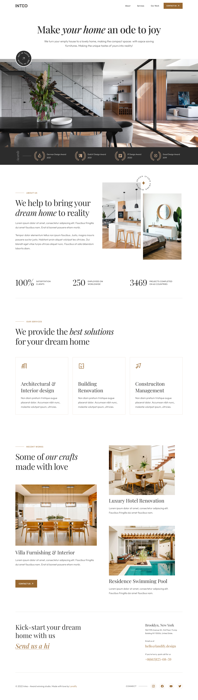
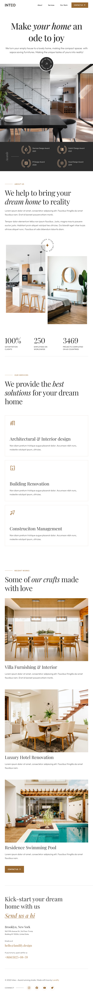
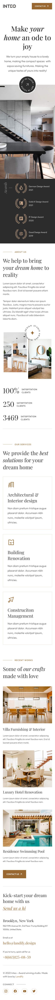

# Inteo - Architecture and Interior Design Studio Mobile,Tablet & Web Responsive App

## App Concept
App concept created and inspired by [Inteo - Architecture and interior design studio template.](https://preview.landify.design/inteo/) design found on Landify.

## Fully Responsive
A nice clean Architecture and Interior Design Studio App for Designer or developers.
Inteo is an app modern and elegant architecture and interior design studio site template. If you are looking to start an interior design studio or revamp your existing site template, this is a big time saver!
We redesign the app also make it responsive so that you can run it everywhere on your phone, tab, or web. In this responsive project, we will show you the real power of flutter. Make mobile, web, and desktop app from a single codebase.

## About
The mobile or web app was created to simulate all the system behind the UI kit in the link. There's no code on backend or other web service. The app is all contained in this repository. The models classes was created to better representate an official development, the repositories classes simulate a web request.

## Supported Devices and OS
### The app runs on the following device and platforms
* Android - (Native App and Web)
* iOS and macOS - (Native App and Web)
* Web - (All Browser Versions)

## Supported Modes
### The app runs on the following modes
* Landscape
* Portrait
 
### [Architecture and Interior Design Studio App Responsive Final UI - Web]

Web and iPad Preview           |      Mobile UI Preview
:-------------------------:|:-------------------------:
  |  
